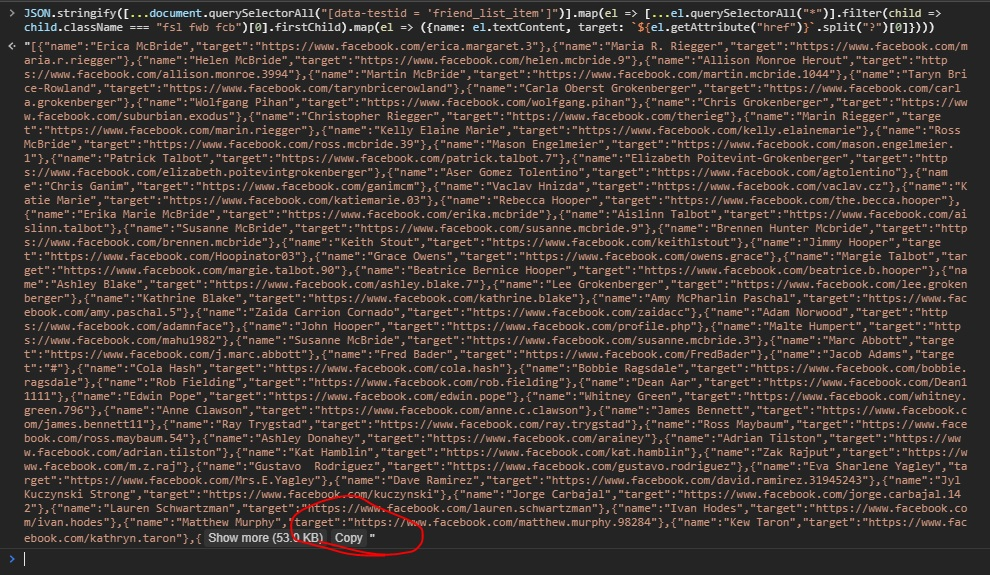

# Hatchling

_Break out of the Facebook Shell by converting your social Data into Turtle Triples_


I'm a fan of Facebook. They create social networks that my grandparents are able to use, and they contribute heavily to the open-source ecosystem. That said, I'm a bigger fan of user empowerment and choice.

Out of the alternatives today, I believe that Tim Berners-Lee's vision for [SOLID (a decentralized social network built around linked-data principles)](https://solid.mit.edu/) offers the most pragmatic vision for data ownership. It offers the possibility that existing social networks could work with the standards bodies and adopt linked data and the SOLID data ownership model. 

However, for this to be a possibility, tech early adopters need to engage with the linked data ecosystem and learn the fundamental of the semantic web. 

This project aims to encourage SOLID adoption by simplifying the process of expressing a profile using linked data and Turtle. It provides a binary that converting provided by Facebook's [Download Your Information](https://www.facebook.com/dyi/?x=AdkiqAMlydfH5oKw) into semantic web triples used by SOLID. 

Note: If you want to learn more about the theory beTo learn more about this, I suggest reading [Linked Data Fundamentals](https://solid.inrupt.com/docs/intro-to-linked-data) on the SOLID website.

## Step 1: Download You Data from Facebook

1. Navigate to Facebook's [Download Your Information](https://www.facebook.com/dyi/?x=AdkiqAMlydfH5oKw).
2. Under Format, select JSON
3. In "Your Information", you can unselect all and then only check "Profile Information." This is the only data we require
4. Wait for Facebook to complete the batch export process. This can take an hour or so.
5. Download the zip file to a suitable location
6. Extract the zip file and copy `profile_information.json` to handy location

## Step 2: [Optional] Export your connections

Facebook's [Download Your Information](https://www.facebook.com/dyi/?x=AdkiqAMlydfH5oKw) advertises the following:


> You can download a copy of your Facebook information at any time. You can download a complete copy, or you can select only the types of information and date ranges you want. You can choose to receive your information in an HTML format that is easy to view, or a JSON format, which could allow another service to more easily import it.


This is quite useful for exporting profile information and all of the Facebook metadata that Facebook tags you with for advertising and tracking purposes. By downloading your personal data, you can get a good grasp of the data that Facebook has on you, and that can help you make informed decisions about your privacy settings and the degree to which your are comfortable being tracked while using Facebook.

However, the most important and valuable data on a social network is often not your profile information, but your friend connections which define your role in the social graph. Looking through the zip file containing JSON of much of my profile, such data was conspicuously absent.

While Facebook does allow you to export "Friends" data, the data only shows a human-friendly encoding of the friend's name. Realistically, services require some sort of globally unique identifier (GUID) to be able to identify someone on the web,which for Facebook would likely be the public URL of a user's Facebook profile. 

`"John Smith" is not useful, but https://www.facebook.com/johnjohn.smith.12345 is.`

To get around this, we can scrape this data off our Facebook profiles using browser DevTools and a bit of JavaScript.

1. Go to https://www.facebook.com/bushidocodes/friends. The page lazy-loads friends for performance reasons, so scroll to the bottom of the friends section until all friends are listed. You should see a page break showing "More About You" when you are at the bottom of the friends section
2. Open your browser DevTools to the console (Ctrl+Shift+j on Chromium on Windows)
3. Review the following JavaScript code to trust that I'm not doing anything nefarious. The script essentially extracts your list of friends and the URL of their Facebook profiles. 
```js
JSON.stringify([...document.querySelectorAll("[data-testid = 'friend_list_item']")].map(el => [...el.querySelectorAll("*")].filter(child => child.className === "fsl fwb fcb")[0].firstChild).map(el => ({name: el.textContent, target: `${el.getAttribute("href")}`.split("?")[0]})))
```
4. After executing, you should see the first bit of the resulting JSON object. At the bottom (in Chromium), you have a Copy button. Click to copy this data.

5. Use a code editor to paste this data into a `friends.json` file and save to the same directory as `profile_information.json`

## Step 3: Download and Run Binary

1. [Download the binary for the appropriate platform and architecture](https://github.com/bushidocodes/hatchling/releases) (at this time, only x64 Linux and Windows are supported) to the same directory as your JSON files
2. Start a command prompt and navigate to the folder with the binary and JSON files
3. Run `hatchling.exe profile_information.json out.ttl` if you skipped Step 2. Otherwise run `hatchling.exe --friends friends.json profile_information.json out.ttl`.

## Step 4: Validate and Edit Output file

Now that you've generated a Turtle file, you should verbally inspect the output and manually remove privileged data.

When done, you can validate your file for correct syntax [with the W3C validator](https://www.w3.org/2015/03/ShExValidata/)